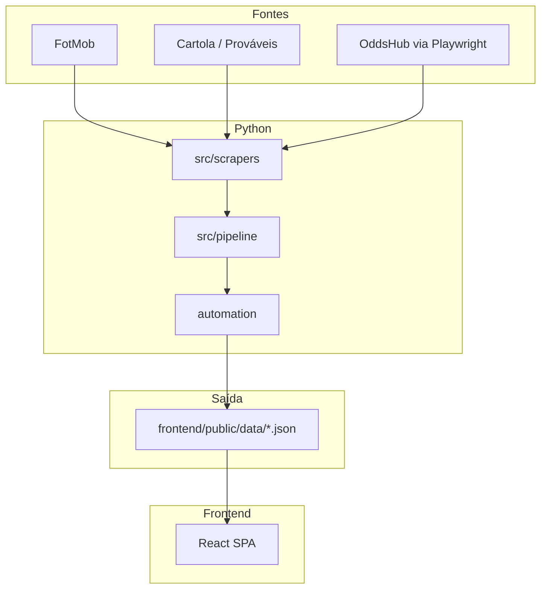

# Arquitetura — Data CFC WC2026

Projeto arquivado após o fim da Copa. Este documento descreve o fluxo que rodou em produção.

## Visão geral

Scrapers e pipelines em Python geram JSONs estáticos. O frontend React consome esses arquivos de `frontend/public/data/`. Em produção, um push no `main` disparava deploy na Vercel.

## Fontes e artefatos

| Fonte | Papel | Exemplos de saída |
|-------|--------|-------------------|
| FotMob | Classificação, confrontos, scouts, mata-mata | `copa_estado.json`, `classificacao_grupos.json`, `mata_mata.json`, `selecoes.json`, `pontuacao_cedida.json` |
| Cartola / Prováveis | Mercado, status, fotos | `jogadores_mercado.json` |
| OddsHub (Playwright) | GA% / SG% e eventos | `odds_jogadores.json`, `eventos_odds_rodada1.json` |
| Elo (auxiliar) | Ratings de seleções | `elo_copa_2026.json` |

## Onde está o código

| Área | Caminho |
|------|---------|
| Scrapers | [`src/scrapers/`](src/scrapers/) — FotMob, Cartola, odds, matching |
| Pipeline | [`src/pipeline/`](src/pipeline/) — orquestração Copa / timestamp |
| Automação | [`automation/`](automation/) — scripts `.ps1` / `.py` de atualização |
| Actions | [`.github/workflows/`](.github/workflows/) — hoje só `workflow_dispatch` (sem cron) |
| UI | [`frontend/src/`](frontend/src/) — abas Grupos, Mata-mata, HUB Seleções, HUB Jogadores |
| Dados servidos | [`frontend/public/data/`](frontend/public/data/) |

## Deploy (histórico)

1. Workflow (ou script local) rodava scrapers e commitava JSONs alterados.
2. Push em `main` → Vercel buildia o Vite app.
3. SPA lia `/data/*.json` em runtime (sem API própria).

Odds costumavam ser mais estáveis no PC (Playwright + Chromium); runners de CI às vezes esbarravam em bloqueio.

## Estado atual

- Schedules do GitHub Actions e tarefas do Agendador Windows **desligados**.
- Demo permanece no ar com o último snapshot de dados da Copa.
