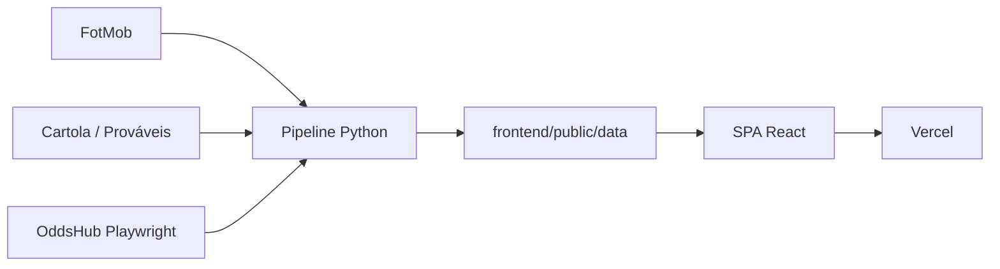

# Data CFC — Copa do Mundo 2026

**Status: arquivado (demo congelada).** A Copa do Mundo 2026 acabou e os dados não são mais atualizados. O site permanece no ar como case study.

**Demo:** [datacfc-wc2026.vercel.app](https://datacfc-wc2026.vercel.app) · **Repo:** [guilhrmelopes/datacfc-wc2026](https://github.com/guilhrmelopes/datacfc-wc2026)

Dashboard de análise para quem jogou o **Cartola FC** na Copa do Mundo: scouts de seleções e jogadores, classificação, mata-mata e contexto de odds (Anytime Goalscorer, Player To Assist, Player To Score or Assist, Clean Sheet) num só lugar.

## O que o produto faz

| Aba | Conteúdo |
|-----|----------|
| **Fase de Grupos** | Classificação dos grupos A–L |
| **Mata-mata** | Chave / bracket até a final |
| **HUB Seleções** | Scouts coletivos (gols, posse, xG, desarmes, etc.) e recorrência |
| **HUB Jogadores** | Rankings por posição (GOL, LAT, ZAG, MEI, ATA), ratings, próximo adversário, odds e cobradores |

## Stack

- **Frontend:** React 19, Vite 6, TypeScript, Tailwind CSS 4, Radix UI
- **Dados:** Python 3.12, Playwright (odds), PowerShell automation
- **Deploy:** GitHub Actions → commit de JSONs → Vercel

## Arquitetura (visão geral)



Detalhes em [ARCHITECTURE.md](ARCHITECTURE.md).

## Como rodar localmente (dev)

```powershell
cd frontend
npm install
npm run dev
```

Os JSONs já estão em `frontend/public/data/`. O pipeline Python / scrapers ficam no repo para referência histórica; **não há mais agenda automática** (cron desligado).

## Licença / uso

Projeto pessoal / portfólio. Fontes de dados de terceiros (FotMob, Cartola, etc.) sujeitas aos termos de cada provedor.
